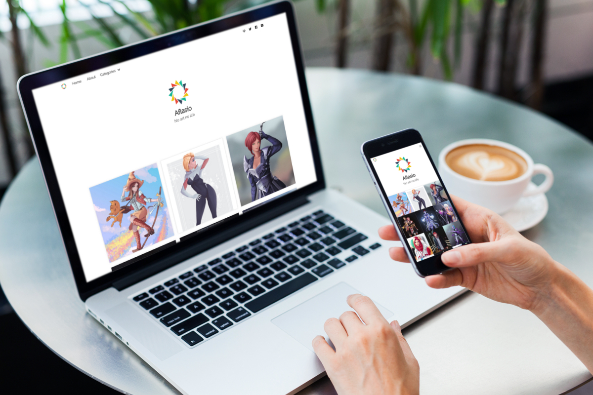

## Hexo Theme Griddy

### "A hexo theme for artist gallery or portfolio sample"

This theme is created by combine both of [Goyangin](https://github.com/g3xx/goyangin) and [Magnetic](https://github.com/klugjo/hexo-theme-magnetic) using ejs and bulma framework

### [Live Demo](https://hexo-theme-griddy.netlify.com)

### [Sample Post](https://hexo-theme-griddy.netlify.com/post/pepper-carrot-fanart/)
This Theme is automatically generate your category by the front matter.


[mockup template](https://www.freepik.com/free-psd/laptop-mobile-mock-up-design_1053178.htm)

### Feature
 - Responsive 
 - Google Analytics
 - SEO
 - Disqus, Facebook, or Valine comment
 - Gallery with fancybox
 - Grid
### Installation
Clone the theme

```bash
git clone https://github.com/sira313/hexo-theme-griddy themes/griddy
```

Modify file hexo `_config.yml` site

```bash
theme: griddy
```

And, Modify Config Theme in `/themes/griddy/_config.yml`
```yaml
# THIS IS MY SAMPLE CONFIG, YOU NEED TO MODIFY TO YOURS

menu:
  Home: /
  About: /about #you need to create "about" page first

# Default post title
default_post_title: Untitled #default post title will automatically show if you forgot to write the title of your post

# Default post cover index page
default_cover_index: "/img/seira.jpg" #default cover index will automatically show if you forgot to set up the cover index on your post. This is using square ratio, change to your picture path

favicon: /img/favicon.png #favicon is for your logo on the tab's browser. use transparent BG, more small more good.
logo: img/logo.svg #logo show in the menu and header
profilpic: /img/450x450/seira.jpg #profil pic will show on the left side of the post's title
author: Sira Argia #name author in post (default)

comments:
  # Disqus comments
  # disqus_shortname:
  # Facebook comments
  #facebook:
    #appid: 558386947954045
    #comment_count: 5
    #comment_colorscheme: light
  # Valine comments https://valine.js.org
  valine:
    appid:  6jbQfaaH3EJezmsqw43NCcNa-gzGzoHsz
    appkey:  5AsBAiusJURpbNDHTP4LHwA6
    notify: false # true/false:mail notify !!!Test,Caution. https://github.com/xCss/Valine/wiki/Valine-%E8%AF%84%E8%AE%BA%E7%B3%BB%E7%BB%9F%E4%B8%AD%E7%9A%84%E9%82%AE%E4%BB%B6%E6%8F%90%E9%86%92%E8%AE%BE%E7%BD%AE
    verify: false # true/false:verify code
    avatar: mm # avatar style https://github.com/xCss/Valine/wiki/avatar-setting-for-valine
    placeholder: Leave comment # comment box placeholder
    
google_analytics: UA-128493937-1 #get your google analytic on https://analytics.google.com/analytics

# if u want add more profile media social (icon same as Fontawesome 5)
#  just add name ex : Instagram: https://www.instagram.com/you/
social:
  Gitlab: https://gitlab.com/sira313
  Twitter: https://twitter.com/aflasio
  Facebook: https://facebook.com/aflasio.art
  #Google-plus: https://plus.google.com/104751165505597913805
  email: mailto:sira.argia@gmail.com
  #Instagram: https://www.instagram.com/you/

# Code Highlight theme
# Available value:
#    default | normal | night | night eighties | night blue | night bright
# https://github.com/chriskempson/tomorrow-theme
highlight_theme: night eighties

```
### Getting Started with Post
1. Create post.`$ hexo new post "Oh Yeah!"`
2. Edit file in `source` > `post`
3. Category will autoload to the menu
4. You can load multi images in the header, just like this
```
---
title: Oh Yeah!
date: 2018-10-27 00:06:53
tags: 
  - digipaint
  - OC
  - male
  - black
  - red hair
  - red
categories: Digital Painting
cover_index: /img/450x450/seira.jpg
photos: 
- /img/seira.jpg
- /img/seira2.jpg
---
Here's the caption or description of your photos/

```
### Notes

- `update`
  Page now have it's own layout
- Maybe you have to create your own using html + bulma and import it useing ejs. My sample is on `layout` > `partial` > `headers.ejs`

### TODO

- [x] Improve layout for another page
- [x] Show post as modal
- [ ] Push browser history to modal post
- [ ] Improve comments on the modal post

### Version Logs

- This maybe Beta Version 
> I am so sorry if you find any trouble 'cause for the real i just copy paste the script.
### Support Me

[](https://paypal.me/aflasio)
